# Facture-V1.0
Application de gestion des factures

Facture-V1.0 est une application développée sous Excel-VBA pour la gestion des factures d’une entreprise avec 50 lignes des articles maximum pour chaque facture. 
 ## Interface utilisateur principale
 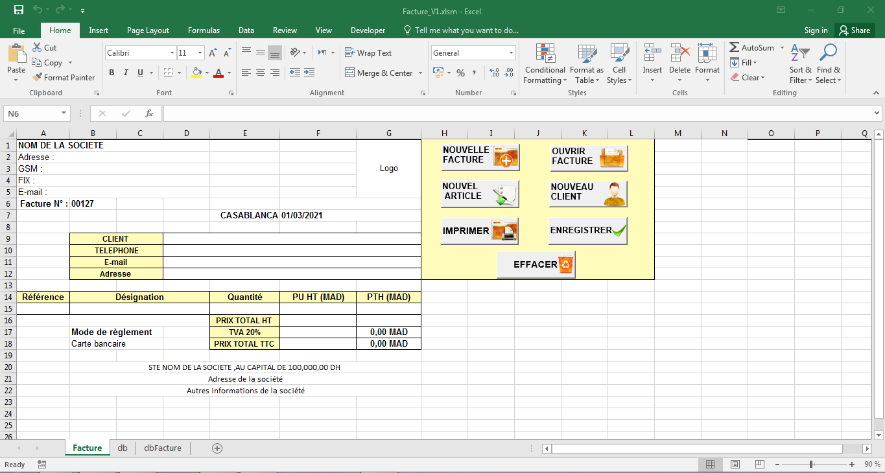
 
 Cette Interface présente :
 1. Les informations qui contient une facture
   * Les informations de l’entreprise
   
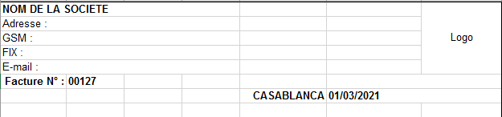

Le nom de la société doit être saisi au début afin qu’il soit affiché dans les autres interfaces des fonctionnalités de l’application.
Ainsi le logo doit insérer dans la section Logo pour qu’il soit affiché lors de l’impression d’une facture.  

* Les informations du client

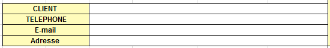

* Les informations des articles achetés

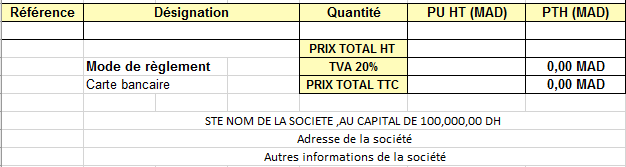

2. Les fonctionnalités de l’application

* La création d’une nouvelle facture

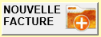

* L’ouverture d’une facture

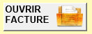

* L’insertion d’un nouvel article

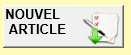

* L’insertion d’un nouveau client

*	L’impression de la facture

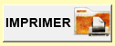

*	L’enregistrement d’une facture

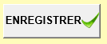

*	L’effacement d’une facture

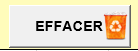

## La feuille db
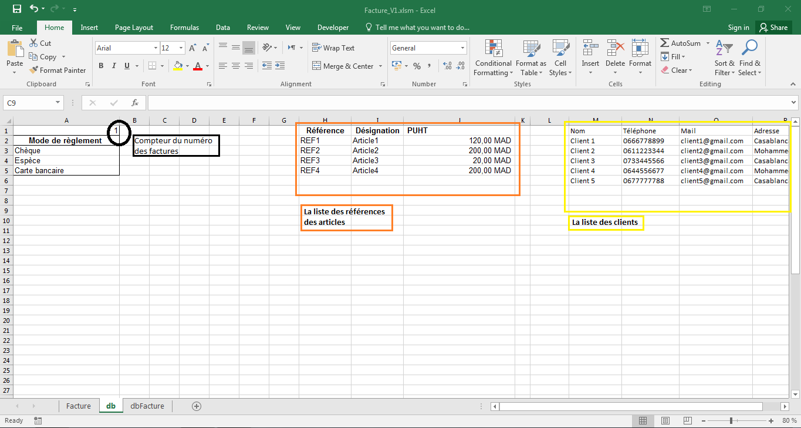

## La feuille dbFacture
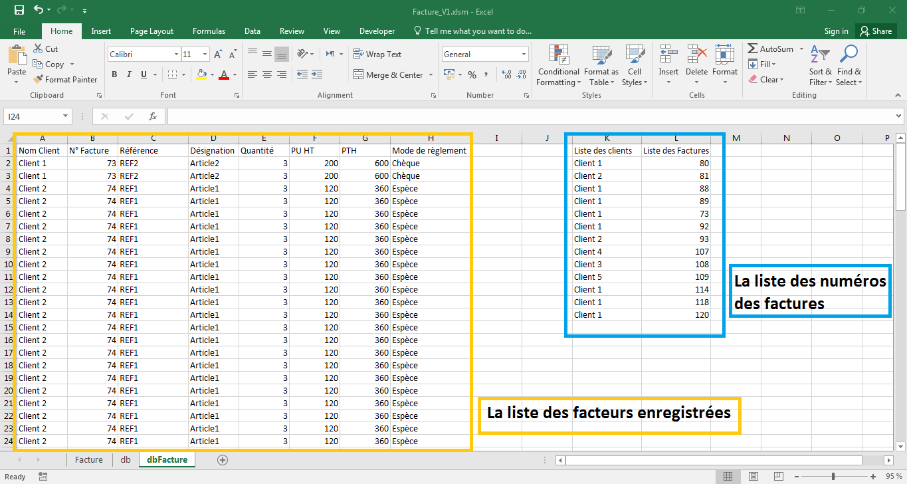

NB : Les deux feuilles db et dbFacture seront cachées dans le fichier source

## Les détails des fonctionnalités de l’application 

1. La création d’une nouvelle facture

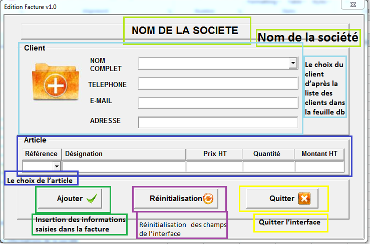

Cette interface permet à l’utilisateur créer une nouvelle facture pour un client dont les informations déjà enregistré dans la feuille db, ainsi que les articles.
Donc pour un nouveau client ou un nouvel article, l’utilisateur doit tout d’abord commencer par l’enregistrement des données du client ou de l’article d’après les boutons NOUVEAU CLIENT et NOUVEL ARTICLE.
Le bouton Ajouter permet d’insérer les données saisies automatiquement dans la feuille Facture dans la section des informations des articles achetés.
Après l’insertion des données du premier article, le bouton Réinitialisation permet de vider les champs de la partie Article de l’interface afin que l’utilisateur puisse ajouter des autres articles à la facture.
Le bouton Quitter pour fermer l’interface.

2. L’ouverture d’une facture

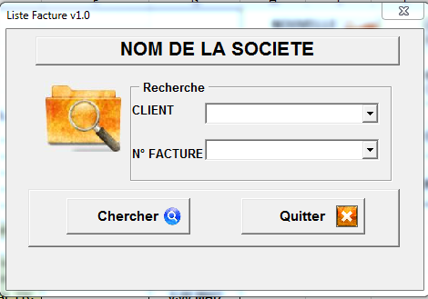

La fonctionnalité OUVRIR FACTURE permet d’ouvrir une facture enregistrée dans la liste des factures dans la feuille dbFacture. 
L’utilisateur choisie le nom du client et le numéro de la facture d’après les listes des choix, puis clique sur le bouton Chercher, et ensuite les données sont affichée dans la feuille Facture.

3. L’insertion d’un nouvel article

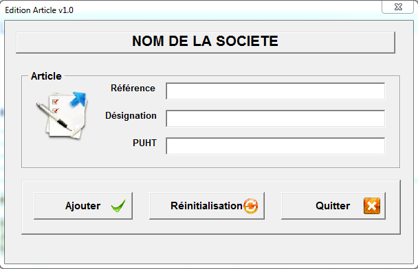

La fonctionnalité NOUVEL ARTICLE permet à l’utilisateur d’enregistrer les informations de ses articles dans la feuille db, pour les utiliser lors de la création des nouvelles factures.

4. L’insertion d’un nouveau client

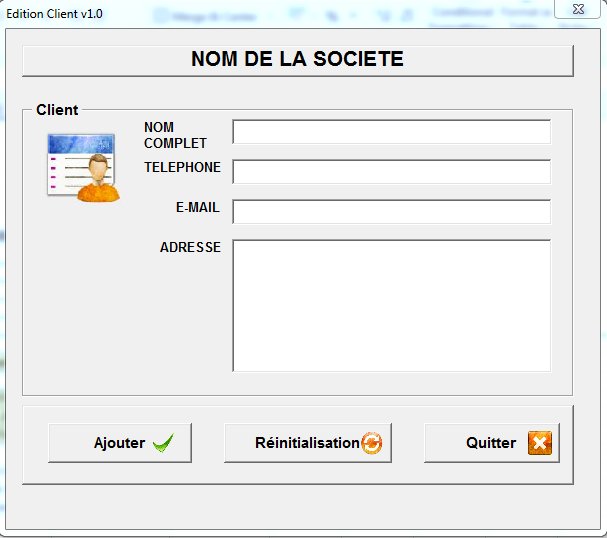

La fonctionnalité NOUVEAU CLIENT permet à l’utilisateur d’enregistrer les informations de ses nouveaux clients dans la feuille db, pour les utiliser lors de la création des nouvelles factures.

5. L’impression de la facture

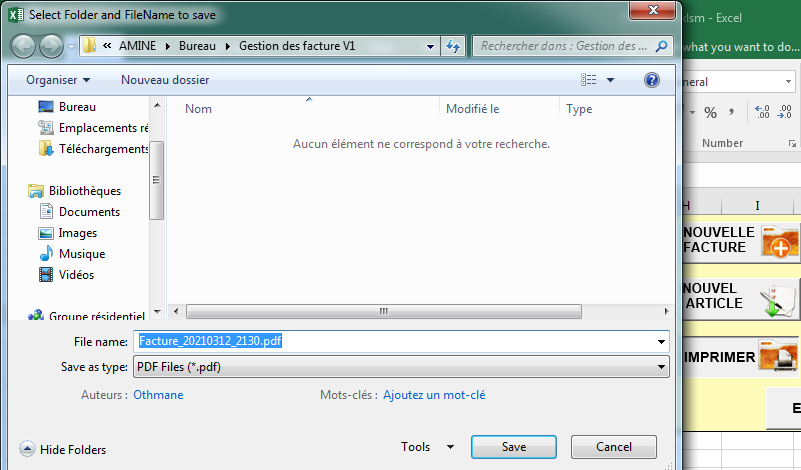

Le bouton IMPRIMER permet l’enregistrement des données de la facture, saisies dans la feuille Facture sous format pdf et dans le même emplacement où se trouve le fichier de l’application.
Le nom du fichier généré contient la date du jour ainsi que l’heure actuelle.

6. L’enregistrement d’une facture

Le bouton ENREGISTRER permet d’enregistrer les données de la facture saisie dans la feuille Facture.

7. L’effacement d’une facture

Le bouton EFFACER permet de vider la feuille Facture des données de la facture actuelle.

## Exemple d’un fichier pdf d’une facture

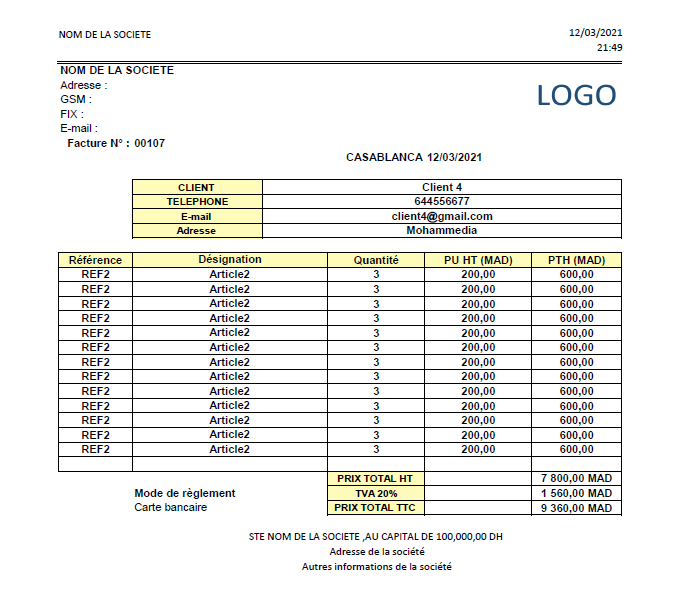
